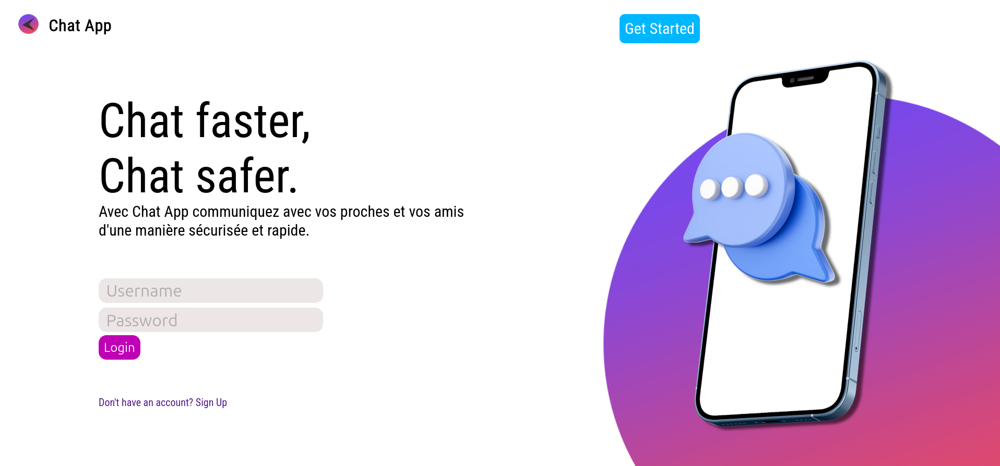
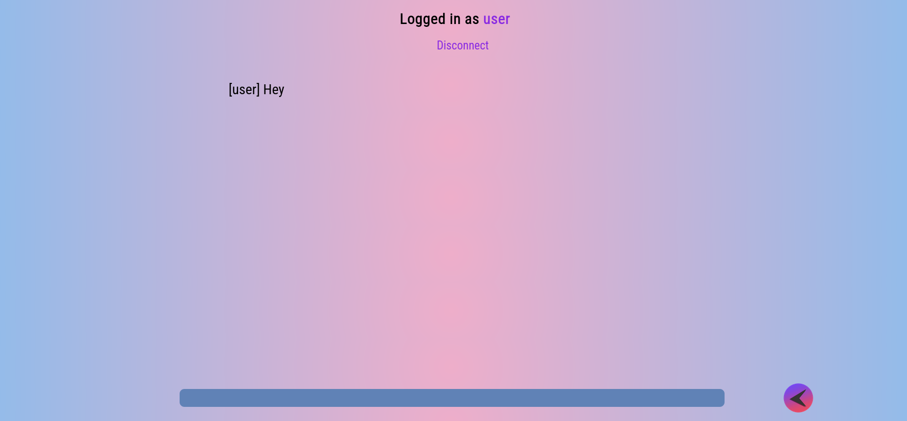

# Web Chat App

A real-time chat application with user authentication built using Flask and WebSocket technology. This was my first full-stack web project featuring a Python backend.
⚠️ Disclaimer: This is one of my first web apps I made a while ago so most of the implementations are terrbile.

## 🎥 Demo

[Watch Demo Video](https://youtu.be/8K1fESzmhQc)

## 📸 Screenshots

| Home Page | Chat Interface |
|-----------|----------------|
|  |  |

## ✨ Features

- Real-time messaging using WebSocket
- User authentication system
- Multi-user support (load tested with 20+ concurrent users)
- Live chat updates across all connected clients

## 🛠️ Tech Stack

- **Backend**: Flask (Python)
- **Real-time Communication**: WebSocket
- **Frontend**: HTML, CSS, JavaScript

## 🚀 Getting Started

### Prerequisites

- Python 3.x installed on your system

### Installation

1. **Clone the repository**
   ```bash
   git clone <repository-url>
   cd web-chat-app
   ```

2. **Create a virtual environment**
   ```bash
   python -m venv venv
   ```

3. **Activate the virtual environment**
   - Windows:
     ```bash
     venv\Scripts\activate
     ```
   - macOS/Linux:
     ```bash
     source venv/bin/activate
     ```

4. **Install dependencies**
   ```bash
   pip install -r requirements.txt
   ```

5. **Run the server**
   ```bash
   python Server.py
   ```

6. **Access the application**
   
   Open your browser and navigate to the localhost URL displayed in the terminal (typically `http://localhost:5000`)

## 🔮 Future Improvements

- [ ] **UI/UX Redesign** - Modernize the interface for better user experience
- [ ] **Frontend Rewrite** - Migrate to React with TypeScript and Tailwind CSS for improved maintainability and scalability
- [ ] **User Roles & Moderation** - Add admin/moderator roles with message management capabilities
- [ ] **Media Sharing** - Implement image and file upload functionality
- [ ] **Enhanced Security** - Improve authentication system with industry best practices (current implementation is a learning prototype)
- [ ] **Message History** - Add persistent message storage and retrieval
- [ ] **User Profiles** - Add customizable user profiles with avatars

## 📝 Note

This project was created as a learning experience and represents my first time at:
- Building a full-stack web application
- Implementing backend logic with Python/Flask
- Handling user authentication
- Working with WebSocket for real-time communication

The code quality reflects this learning journey, and I'm aware of areas that could be improved. Feedback and contributions are welcome!


## 🤝 Contributing

Contributions, issues, and feature requests are welcome! Feel free to check the issues page.

---

**⚠️ Security Note**: This application was built for educational purposes. The authentication system should be significantly improved before any production use.
